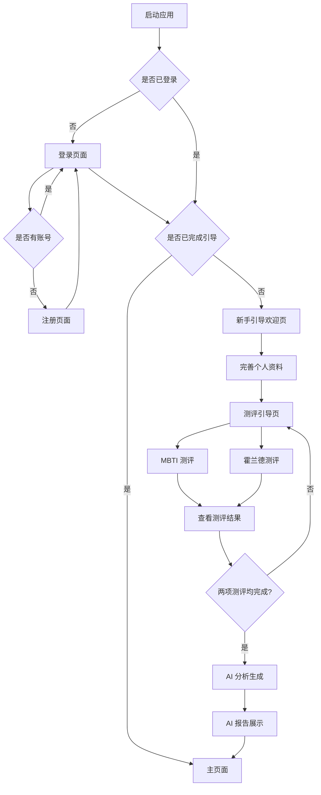
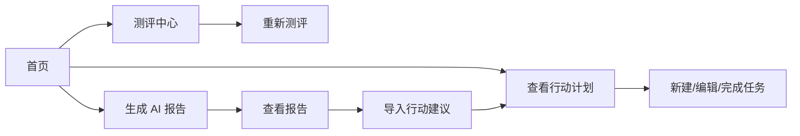
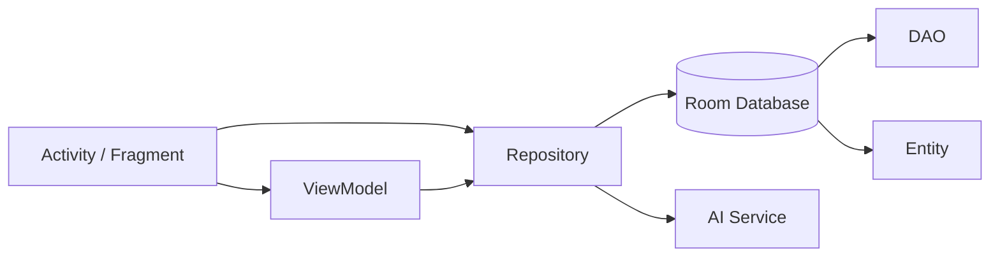
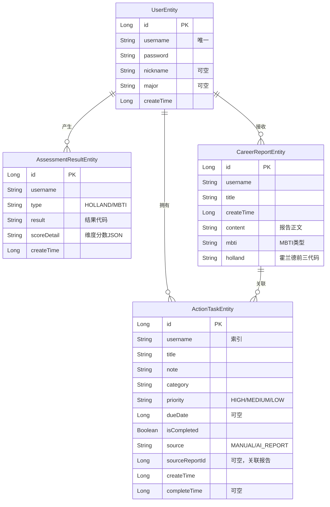

# 职业规划助手

面向大学生和初入职场用户的 Android 职业规划辅助应用。应用整合 MBTI 职业性格测评与霍兰德职业兴趣测评，通过 AI 分析生成结构化职业报告，并提供行动计划管理功能，帮助用户了解自身职业倾向并形成可执行的职业发展计划。

本项目为 Android 课程设计演示版，功能聚焦于测评、分析与计划管理的核心流程演示。

## 项目简介

- **开发背景**：Android 课程设计要求实现一个涵盖 Activity 跳转、Fragment、RecyclerView、Room 数据库、网络请求、BroadcastReceiver 等知识点的综合应用。
- **解决的问题**：提供从"了解自己"到"制定计划"的职业规划闭环体验，将多种测评结果组合后交由 AI 分析。
- **目标用户**：大学生和初入职场用户（课程演示场景）。
- **项目性质**：Android 课程设计演示版，侧重核心流程展示，非正式上线产品。
- **版本**：`1.0`（versionCode 1）

## 项目功能

### 用户系统

| 功能 | 状态 | 说明 |
| --- | --- | --- |
| 用户注册 | ✅ 已实现 | `RegisterActivity`，用户名+密码注册，Room 本地存储 |
| 用户登录 | ✅ 已实现 | `LoginActivity`，Room 验证用户名密码 |
| 登录状态保存 | ✅ 已实现 | `SessionManager` + `SharedPreferences` |
| 退出登录 | ✅ 已实现 | `ProfileFragment`，清空登录态并返回登录页 |
| 新手引导流程 | ✅ 已实现 | 引导页 → 资料完善 → 测评引导 → AI 分析 |

### 个人资料

| 功能 | 状态 | 说明 |
| --- | --- | --- |
| 昵称与专业填写 | ✅ 已实现 | `ProfileSetupActivity`，支持预填已有数据 |
| 资料编辑 | 🟡 部分实现 | 当前仅支持昵称和专业。年龄、性别、学历、年级、期望行业等字段已在 `UserProfile` 模型中定义，但 UI 尚未提供输入入口 |
| 头像 | ❌ 尚未实现 | 当前使用昵称首字母作为文字头像 |

### 职业测评

| 功能 | 状态 | 说明 |
| --- | --- | --- |
| MBTI 职业性格测评 | ✅ 已实现 | 88 道题，E/I、S/N、T/F、J/P 四组维度 |
| 霍兰德职业兴趣测评 | ✅ 已实现 | 60 道题，RIASEC 六维度计分 |
| 职业价值观测评 | ❌ 尚未实现 | 代码中未发现相关实现 |
| 职业能力倾向测评 | ❌ 尚未实现 | 代码中未发现相关实现 |
| 职业锚测评 | ❌ 尚未实现 | 代码中未发现相关实现 |
| 答题进度显示 | ✅ 已实现 | 实时显示"第 X/N 题，已完成 M/N" |
| 答题中断提示 | ✅ 已实现 | 离开时弹出确认对话框，提醒答案不会保存 |
| 测评结果计算 | ✅ 已实现 | `AssessmentScorer` 按维度计分并生成结果代码 |
| 测评结果保存 | ✅ 已实现 | 保存至 Room `assessment_results` 表 |
| 重新测评 | ✅ 已实现 | "重新测评"按钮覆盖最新一次结果 |
| 答题暂存/恢复 | ❌ 尚未实现 | 确认对话框中明确提示"当前版本没有答题暂存" |

### AI 分析

| 功能 | 状态 | 说明 |
| --- | --- | --- |
| AI 职业分析生成 | ✅ 已实现 | 当前使用 `MockAiCareerService` 生成模拟分析结果 |
| 远程 AI API 调用 | 🟡 部分实现 | `RemoteAiCareerService` 已预留完整调用框架，标记为 Phase 2 TODO，当前调用会直接抛出错误 |
| AI 分析报告展示 | ✅ 已实现 | `AiReportActivity` 以卡片形式展示分析结果的 7 个维度 |
| 分析报告保存 | ✅ 已实现 | 保存至 Room `career_reports` 表 |
| 报告历史查看 | ✅ 已实现 | `ReportFragment` 展示最近报告，支持重新生成 |
| 报告导入行动计划 | ✅ 已实现 | 从报告的"未来 1-3 年行动计划"段落解析行动建议，支持多选导入为任务 |
| 加载状态提示 | ✅ 已实现 | `AiAnalyzingActivity` 显示加载动画和文字提示 |
| 失败重试 | ✅ 已实现 | 分析失败时显示错误信息和重试按钮 |
| 重复导入保护 | ✅ 已实现 | 已导入的行动建议标记"已导入"并默认不勾选 |

### 行动计划

| 功能 | 状态 | 说明 |
| --- | --- | --- |
| 任务新增 | ✅ 已实现 | 手动创建任务，填写标题、备注、分类、优先级、截止日期 |
| 任务编辑 | ✅ 已实现 | 点击任务进入编辑对话框 |
| 任务删除 | ✅ 已实现 | 长按或点击删除按钮，有确认对话框 |
| 任务完成/恢复 | ✅ 已实现 | 切换完成状态，完成状态显示删除线 |
| 任务筛选 | ✅ 已实现 | "全部 / 进行中 / 已完成" 三个 Tab 切换 |
| 分类体系 | ✅ 已实现 | 学习提升、求职准备、项目实践、职业探索、其他 |
| 优先级 | ✅ 已实现 | 高 / 中 / 低 三个级别 |
| 截止日期 | ✅ 已实现 | DatePicker 选择日期，支持清除 |
| 任务来源标记 | ✅ 已实现 | 区分"手动添加"和"AI 建议" |

### 用户中心

| 功能 | 状态 | 说明 |
| --- | --- | --- |
| 个人统计展示 | ✅ 已实现 | 显示测评数、报告数、进行中任务数 |
| 快捷入口 | ✅ 已实现 | 个人资料、历史报告、行动计划、数据导出、通知、隐私、关于 |
| 隐私说明 | ✅ 已实现 | 弹窗说明数据存储方式 |
| 关于应用 | ✅ 已实现 | 弹窗说明应用定位 |
| 数据导出 | ❌ 尚未实现 | 点击弹出"数据导出功能开发中"提示 |
| 通知与提醒 | ❌ 尚未实现 | 点击弹出"通知与提醒功能开发中"提示 |

### 其他

| 功能 | 状态 | 说明 |
| --- | --- | --- |
| 强制下线模拟 | ✅ 已实现 | `ForceOfflineReceiver` + 自定义广播 Action |
| 首页欢迎卡片 | ✅ 已实现 | `HomeFragment` 展示用户名、头像字符和 AI 助手引导 |
| 测评前置检查 | ✅ 已实现 | 未完成两项测评时禁用"生成 AI 报告"按钮 |
| 屏幕安全区适配 | ✅ 已实现 | `SystemBarInsets` 工具方法处理状态栏和导航栏 |

## 核心业务流程

### 主要流程



### 日常使用流程



### 流程说明

1. 新手引导仅首次登录时触发，完成后跳转主页面。
2. 首次引导中完成资料填写和测评后，自动进入 AI 分析生成环节。
3. 之后从首页可以直接进入测评、生成报告或管理行动计划。
4. 职业报告页（Plan Tab 下的"职业报告"子页）支持将报告中的行动建议导入为可管理的任务。

## 页面说明

| 页面 | 对应类 | 布局文件 | 主要功能 |
| --- | --- | --- | --- |
| 启动/登录 | `LoginActivity` | `activity_login.xml` | 用户登录，自动跳转 |
| 注册 | `RegisterActivity` | `activity_register.xml` | 创建新账号 |
| 新手引导欢迎 | `OnboardingWelcomeActivity` | `activity_onboarding_welcome.xml` | 引导开始页 |
| 资料完善 | `ProfileSetupActivity` | `activity_profile_setup.xml` | 填写昵称和专业 |
| 测评引导 | `AssessmentGuideActivity` | `activity_assessment_guide.xml` | 选择测评类型，查看完成状态 |
| 答题 | `QuestionActivity` | `activity_question.xml` | 逐题作答，提交并查看结果 |
| AI 分析中 | `AiAnalyzingActivity` | `activity_ai_analyzing.xml` | 显示分析进度 |
| AI 报告 | `AiReportActivity` | `activity_ai_report.xml` | 展示结构化分析报告 |
| 主页面 | `MainActivity` | `activity_main.xml` | BottomNavigationView 容器，管理 4 个 Tab |

### Fragment 页面（MainActivity 内部）

| Tab | Fragment | 布局文件 | 主要功能 |
| --- | --- | --- | --- |
| 首页 | `HomeFragment` | `fragment_home.xml` | 欢迎区、AI 对话式引导、行动计划概览 |
| 测评 | `AssessmentFragment` | `fragment_assessment.xml` | 霍兰德和 MBTI 测评入口 |
| 规划 | `PlanFragment` | `fragment_plan.xml` | ViewPager2 容器，内含两个子页 |
| ┣ 职业报告 | `ReportFragment` | `fragment_report.xml` | 查看报告内容，导入行动建议 |
| ┗ 行动计划 | `ActionPlanFragment` | `fragment_action_plan.xml` | 任务列表，筛选，增删改查 |
| 我的 | `ProfileFragment` | `fragment_profile.xml` | 个人统计、菜单入口、退出登录 |

所有 Activity 均设置了 `screenOrientation="portrait"`（竖屏锁定）。

## 技术栈

| 类型 | 技术 | 版本 |
| --- | --- | --- |
| 开发语言 | Kotlin | 2.2.10 |
| 开发工具 | Android Studio | 推荐最新稳定版 |
| UI 框架 | XML Layout + Material Components | material 1.13.0 |
| 视图绑定 | ViewBinding | 已启用 |
| 页面架构 | Activity + Fragment | fragment-ktx 1.8.9 |
| 底部导航 | BottomNavigationView | Material Components |
| 页面滑动 | ViewPager2 | 1.1.0 |
| 列表控件 | RecyclerView | 1.4.0 |
| 数据持久化 | Room (SQLite) | 2.8.4 |
| 本地配置 | SharedPreferences | Android 标准 |
| 异步处理 | Kotlin Coroutines + LiveData | lifecycle 2.10.0 |
| 架构模式 | MVVM (部分页面) | ViewModel + Repository |
| JSON 解析 | org.json (Android 内置) | — |
| AI 服务 | MockAiCareerService (课程演示) | — |
| 最低 SDK | Android 7.0 (API 24) | — |
| 目标 SDK | Android 16 (API 36) | — |
| 编译 SDK | API 36 | — |
| JDK | 17 | — |
| AGP | 9.1.1 | — |

> 注意：项目版本目录中声明了 Jetpack Compose 相关依赖（compose-bom 等），但实际 `app/build.gradle.kts` 中并未引入 Compose 插件和依赖。项目 UI 完全基于 XML Layout。

## 项目架构

项目采用简化的 MVVM 架构。AI 分析页面严格遵循 ViewModel → Repository → Service 分层，登录和测评页面则直接在 Activity 中调用 Repository（未抽取 ViewModel）。



### 分层说明

| 层级 | 目录 | 职责 |
| --- | --- | --- |
| View | `ui/` | Activity 和 Fragment，负责页面展示与用户交互 |
| ViewModel | `ui/ai/AiAnalysisViewModel.kt` | 管理 AI 分析的 UI 状态（Loading/Success/Error） |
| Repository | `data/repository/` | 封装数据操作，统一管理 Room 和 AI 服务调用 |
| DAO | `data/database/dao/` | Room 数据库操作接口 |
| Entity | `data/database/entity/` | Room 数据库表定义 |
| Model | `data/model/` | 业务数据模型（UserProfile、AiAnalysisResponse 等） |
| AI Service | `data/ai/` | AI 分析服务接口与实现（Mock + Remote 预留） |
| Adapter | `ui/home/BannerAdapter.kt`、`ui/plan/ActionTaskAdapter.kt`、`ui/assessment/QuestionAdapter.kt` | RecyclerView 适配器 |
| Util | `utils/` | 工具方法（系统栏适配、常量） |
| Receiver | `receiver/` | BroadcastReceiver（强制下线） |

### 遗留代码说明

`service/` 目录下的 `CareerAiService`、`MockCareerAiService`、`RealCareerAiService` 为早期版本的 AI 服务代码，当前版本的实际 AI 分析逻辑位于 `data/ai/` 目录下。`network/api/CareerApiService.kt` 为空接口，尚未实现网络请求逻辑。

## 项目目录结构

```text
app/
├── src/main/
│   ├── java/com/example/whatsnextdemo/
│   │   ├── MainActivity.kt                   # 主页面（BottomNavigationView 容器）
│   │   ├── data/
│   │   │   ├── ai/                            # AI 分析服务（AiCareerService、Mock、Remote）
│   │   │   ├── database/
│   │   │   │   ├── AppDatabase.kt             # Room 数据库（版本 3）
│   │   │   │   ├── ActionTaskValues.kt        # 任务常量（优先级、来源、分类）
│   │   │   │   ├── dao/                       # DAO 接口
│   │   │   │   └── entity/                    # 数据库实体
│   │   │   ├── local/
│   │   │   │   ├── SessionManager.kt          # SharedPreferences 登录状态管理
│   │   │   │   └── AssetQuestionDataSource.kt # 从 assets 加载题库 JSON
│   │   │   ├── model/                         # 业务数据模型
│   │   │   └── repository/                    # Repository 层
│   │   ├── network/api/                       # 网络 API 接口（空接口预留）
│   │   ├── receiver/
│   │   │   └── ForceOfflineReceiver.kt        # 强制下线广播接收器
│   │   ├── service/                           # 早期 AI 服务代码（当前未使用）
│   │   ├── ui/
│   │   │   ├── ai/                            # AI 报告展示
│   │   │   ├── assessment/                    # 答题与计分
│   │   │   ├── home/                          # 首页 Fragment
│   │   │   ├── login/                         # 登录 Activity
│   │   │   ├── main/                          # PackageInfo
│   │   │   ├── onboarding/                    # 新手引导流程
│   │   │   ├── plan/                          # 规划 Tab（报告+行动计划）
│   │   │   ├── profile/                       # 个人中心 Fragment
│   │   │   ├── register/                      # 注册 Activity
│   │   │   └── report/                        # 报告查看 Fragment
│   │   └── utils/
│   │       ├── Constants.kt                   # SharedPreferences Key 常量
│   │       └── SystemBarInsets.kt             # 系统栏适配工具
│   ├── res/
│   │   ├── layout/                            # 所有布局 XML（约 22 个）
│   │   ├── drawable/                          # 图标和背景（约 26 个）
│   │   ├── menu/
│   │   │   └── menu_bottom_navigation.xml     # 底部导航菜单
│   │   ├── values/
│   │   │   ├── strings.xml                    # 字符串资源
│   │   │   └── themes.xml                     # 主题定义
│   │   └── xml/
│   │       ├── backup_rules.xml
│   │       └── data_extraction_rules.xml
│   ├── assets/
│   │   ├── holland_questions.json             # 霍兰德题库（60 题）
│   │   ├── mbti_questions.json                # MBTI 题库（88 题）
│   │   └── mbti-questios.json                 # MBTI 题库文件名备用（拼写变体）
│   └── AndroidManifest.xml
├── build.gradle.kts
└── proguard-rules.pro
```

## 数据持久化设计

### 存储方式一览

| 数据类型 | 保存方式 | 说明 |
| --- | --- | --- |
| 登录状态 | `SharedPreferences` | 保存 `isLogin`、`username`、引导完成标记 |
| 用户信息 | Room `users` 表 | 用户名、密码、昵称、专业 |
| 测评结果 | Room `assessment_results` 表 | 测评类型、结果代码、维度分数 JSON |
| 职业报告 | Room `career_reports` 表 | AI 分析内容的可读文本和 JSON |
| 行动任务 | Room `action_tasks` 表 | 任务标题、备注、分类、优先级、截止日期、来源、完成状态 |
| 测评题库 | Assets JSON 文件 | `holland_questions.json`、`mbti_questions.json` |

### 数据库信息

- **数据库名称**：`career_planner.db`
- **数据库类**：`AppDatabase`
- **当前版本**：3
- **导出 Schema**：否

### 数据库 ER 关系



各表通过 `username` 字段关联用户。`ActionTaskEntity.sourceReportId` 关联 `CareerReportEntity.id`，用于标记从报告导入的任务，支持重复导入检测。

### 数据库迁移

- **v1 → v2**：空迁移（版本递增）。
- **v2 → v3**：新增 `action_tasks` 表及 3 个索引（username、username+isCompleted、username+sourceReportId+title）。

## 测评系统说明

### 测评一览

| 测评 | 题目数量 | 计分维度 | 选项类型 | 数据来源 |
| --- | ---: | --- | --- | --- |
| MBTI 职业性格 | 88 | E/I、S/N、T/F、J/P（8 个子维度） | 每题 2 选 1（对应维度子类型） | `mbti_questions.json` |
| 霍兰德职业兴趣 | 60 | R、I、A、S、E、C（6 个维度） | 5 级李克特量表（非常不同意→非常同意） | `holland_questions.json` |

### 计分算法

**MBTI**：每题两个选项分别对应维度的两个方向（如 E 或 I），选择后对应方向 +1。全部完成后比较各维度两个方向的得分，较高者构成结果代码（如 ENTJ），平局时取前者。

**霍兰德**：每题选项索引即原始分（0-4），加上基础分 1（即 1-5 分）。若标记为反向题（`reverse: true`），则用 6 减去原始分。按 RIASEC 六个维度分别累加，取前三高分的维度代码组成结果（如 SAE）。

### 结果格式

计分完成后生成两类数据：
- `result`：结果代码（如 `ENTJ`、`SAE`）
- `scoreDetail`：各维度分数 JSON（如 `{"E":12,"I":10,"S":8,...}`）

结果通过 `AlertDialog` 弹窗展示，同时保存到 Room 数据库。

### 其他特性

- **重新测评**：支持，新结果会作为新记录插入数据库，查询时取最新一条。
- **测评历史**：所有结果保留在 `assessment_results` 表中，可通过 `AssessmentRepository.getResults()` 查询。
- **答题中断**：未提交的答案不保存。退出时如已有答题，会弹出确认对话框。
- **答题暂存**：当前版本不支持，代码中明确说明"当前版本没有答题暂存"。

## AI 分析功能

### 实现方式

项目实际使用 `MockAiCareerService` 生成分析结果，无需网络即可运行。该服务根据用户资料（昵称、专业等）、MBTI 结果和霍兰德结果拼合生成固定结构的模拟职业分析。

### 调用位置

- `AiAnalysisViewModel` → `AiCareerRepository` → `AiCareerService`（接口）
- 当前注入的实例：`MockAiCareerService()`
- 远程调用预留：`RemoteAiCareerService`（类已实现，但调用会抛出错误）

### 请求内容

`AiPromptBuilder` 构建的 Prompt 包含：
- 用户基础资料（昵称、年龄、性别、学历、学校、专业、年级、期望行业、优势、兴趣）
- MBTI 结果类型和各维度得分
- 霍兰德结果前三代码和各维度得分
- 用户补充说明

> 注：当前 `AiAnalysisViewModel.buildRequest()` 中部分字段被硬编码为固定值（如 `education = "本科"`、`expectedIndustry = "AI 应用、软件开发、数据分析"`），因为 UI 尚未提供这些字段的输入入口。

### 返回格式

AI 返回结构化 JSON，包含 8 个字段：`summary`、`personalityStrengths`、`suitableIndustries`、`suitablePositions`、`learningSuggestions`、`actionPlan`（shortTerm / midTerm / longTerm）、`risks`、`finalAdvice`。

### 展示方式

`AiReportActivity` 以卡片式布局（`view_ai_report_card.xml`）展示分析结果的 7 个信息板块。

### 数据保存

分析结果同时保存为 `CareerReportEntity`（包含可读文本和 MBTI/霍兰德结果摘要），方便历史查看。

### 安全说明

- **API Key 管理**：项目通过 `local.properties` 配置 `AI_API_KEY` 和 `AI_API_ENDPOINT`，Gradle 编译时注入 `BuildConfig`。`local.properties` 已加入 `.gitignore`，不会提交到 Git。
- **客户端直连风险**：客户端直接调用第三方 AI API 仅适合课程演示。正式项目应通过服务端代理中转请求，避免在客户端暴露长期有效的 API Key。
- **当前状态**：`RemoteAiCareerService` 尚未完成 HTTP 调用实现，课程演示使用 `MockAiCareerService` 即可。

### 配置示例

在项目根目录 `local.properties` 中添加：

```properties
AI_API_KEY=your_api_key
AI_API_ENDPOINT=https://api.deepseek.com/
```

## 环境要求

| 项目 | 要求 |
| --- | --- |
| Android Studio | 推荐最新稳定版（项目使用 AGP 9.1.1） |
| JDK | 17 |
| Gradle | 项目使用 Gradle Wrapper，无需手动安装 |
| Android Gradle Plugin | 9.1.1 |
| Kotlin | 2.2.10 |
| Compile SDK | 36 |
| Target SDK | 36 |
| Min SDK | 24（Android 7.0） |
| 模拟器/真机 | Android 7.0+，推荐 Android 13+ |
| 联网 | 非必须：Mock AI 模式下可离线使用全部核心功能。远程 AI API 需联网 |
| API Key | 非必须：使用 MockAiCareerService 无需配置。使用远程 AI 时才需配置 |

## 安装与运行

1. **克隆项目**
   ```
   git clone https://github.com/George-Chen7/WhatsNext-demo.git
   ```

2. **使用 Android Studio 打开项目根目录**（包含 `settings.gradle.kts` 的目录）。

3. **等待 Gradle Sync 完成**。首次同步会下载依赖，可能需要几分钟。

4. **配置 JDK**：在 Android Studio 中确认 JDK 版本为 17（File → Project Structure → SDK Location）。

5. **（可选）配置 AI API Key**：如需使用远程 AI 功能，在项目根目录 `local.properties` 中添加：
   ```properties
   AI_API_KEY=your_api_key
   AI_API_ENDPOINT=https://api.deepseek.com/
   ```
   不配置也可正常使用 Mock AI 模式。

6. **创建并启动 Android 模拟器**（推荐 API 35+），或连接 Android 真机（需开启 USB 调试）。

7. **运行 `app` 模块**：点击 Android Studio 工具栏的 Run 按钮，或使用 Shift+F10。

8. **注册测试账号**：首次启动后进入登录页，点击"注册演示账号"创建新用户。

## 测试账号

项目当前没有预置测试账号。请在注册页面自行创建账号。所有用户数据保存在本地 Room 数据库中。

## 推荐验收演示流程

以下流程覆盖项目的主要功能和课程知识点，适用于课程答辩验收：

1. **启动应用** → 进入登录页。
2. **注册账号** → 点击"注册演示账号"，输入用户名和密码完成注册。
3. **登录** → 返回登录页输入刚注册的账号登录。
4. **新手引导** → 依次完成：欢迎页 → 填写个人资料 → 进入测评引导。
5. **完成 MBTI 测评** → 88 道题，体验答题进度和逐题跳转。
6. **查看 MBTI 结果** → 提交后弹出结果对话框，查看类型和维度分数。
7. **完成霍兰德测评** → 60 道题，5 级量表。
8. **生成 AI 报告** → 两项测评完成后点击"生成 AI 职业分析"。
9. **查看 AI 报告** → 浏览 7 个分析板块（性格优势、行业推荐、岗位推荐、学习建议、行动计划、风险提醒、总结建议）。
10. **进入主页面** → 确认底部 4 个 Tab 切换正常（首页、测评、规划、我的）。
11. **导入行动建议** → 在"规划 → 职业报告"页点击"导入行动建议"，选择条目导入为任务。
12. **管理任务** → 在"规划 → 行动计划"页操作：完成任务、恢复任务、编辑任务、新建任务、删除任务、切换筛选 Tab。
13. **查看个人中心** → "我的"页面查看统计数据，点击菜单项。
14. **退出登录** → 点击底部"退出登录"按钮，确认后返回登录页。
15. **重新登录验证** → 登录同一账号，确认测评结果、报告和任务数据均已持久化。
16. **（扩展展示）强制下线**：可在"我的"页面说明 `ForceOfflineReceiver` 的广播机制，或通过 adb 发送广播演示。

```
adb shell am broadcast -a com.example.whatsnextdemo.action.FORCE_OFFLINE
```

## 课程知识点对应

| 课程知识点 | 项目中的实现 | 状态 |
| --- | --- | --- |
| Activity 页面跳转 | 登录、注册、引导页、答题、报告等页面间 Intent 跳转 | ✅ |
| Intent 数据传递 | 传递测评类型（`EXTRA_ASSESSMENT_TYPE`）、AI 报告 JSON（`EXTRA_AI_REPORT_JSON`）、起始 Tab（`EXTRA_START_TAB`） | ✅ |
| Fragment | `HomeFragment`、`AssessmentFragment`、`PlanFragment`、`ProfileFragment` 等 8 个 Fragment | ✅ |
| ViewPager2 | `PlanFragment` 内嵌 ViewPager2，展示"职业报告"和"行动计划"两个子页 | ✅ |
| RecyclerView | `ActionTaskAdapter`（任务列表）、`BannerAdapter`（首页轮播预留）、`QuestionAdapter`（答题列表，已创建但未用于当前逐题模式） | ✅ |
| BottomNavigationView | 底部 4 个 Tab（首页、测评、规划、我的） | ✅ |
| SharedPreferences | `SessionManager` 保存登录状态、引导完成标记 | ✅ |
| Room 数据库 | `AppDatabase`（4 个 Entity、4 个 DAO、数据库迁移） | ✅ |
| JSON 数据解析 | `AssetQuestionDataSource` 从 Assets 加载题库 JSON，`AiAnalysisResponse.fromJsonString()` 解析 AI 返回 | ✅ |
| 网络请求 | `RemoteAiCareerService` 预留网络调用框架，当前未完成 HTTP 实现 | 🟡 |
| BroadcastReceiver | `ForceOfflineReceiver`，接收强制下线广播并清空登录态 | ✅ |
| 多线程/异步 | Kotlin Coroutines（`Dispatchers.IO`、`viewModelScope`、`lifecycleScope`） | ✅ |
| ViewBinding | 全局启用，所有 Activity/Fragment 使用 Binding 访问视图 | ✅ |
| 屏幕适配 | `dp/sp` 单位、`ConstraintLayout`、`ScrollView`、`SystemBarInsets` 系统栏适配 | ✅ |
| ContentProvider | 代码中未发现实现 | ❌ |
| 多媒体展示 | 代码中未发现图片/音视频播放实现 | ❌ |
| 后台服务 | 代码中未发现 Service 实现 | ❌ |
| 数据共享（FileProvider） | 数据导出功能尚未实现 | ❌ |
| 通知 | 通知与提醒功能尚未实现 | ❌ |

## 项目特色

1. **多种测评整合**：在一个应用中整合 MBTI 和霍兰德两种职业测评，统一管理测评历史和结果。
2. **本地题库管理**：测评题目以 JSON 文件形式存放在 `assets` 目录，无需后端服务即可加载题库。
3. **AI 多源分析**：将用户个人资料、MBTI 结果和霍兰德结果组合为一份完整的 AI 请求 Prompt，生成结构化职业分析报告。
4. **报告转行动计划**：支持从 AI 报告的"行动计划"段落自动解析行动建议，经用户选择后导入为可管理的行动任务，形成"测评 → 分析 → 计划执行"闭环。
5. **课程知识点覆盖**：在单一应用中覆盖 Activity/Fragment、RecyclerView、Room、SharedPreferences、BroadcastReceiver、Coroutines 等课程核心知识点，适合答辩展示。
6. **Mock AI 服务设计**：通过 `AiCareerService` 接口抽象 AI 调用，`MockAiCareerService` 和 `RemoteAiCareerService` 可无缝切换，方便课程演示（Mock）和后续完善（Remote）。

## 当前完成情况

| 模块 | 状态 | 说明 |
| --- | --- | --- |
| 登录注册 | ✅ 已完成 | 用户名+密码注册登录，Room 验证，Session 保持 |
| 新手引导 | ✅ 已完成 | 欢迎页 → 资料完善 → 测评引导 → AI 分析 |
| 个人资料 | 🟡 部分完成 | 仅支持昵称和专业，其他字段在模型中定义但无 UI 入口 |
| MBTI 测评 | ✅ 已完成 | 88 题，四维度计分，结果保存和展示 |
| 霍兰德测评 | ✅ 已完成 | 60 题，六维度计分，李克特 5 级量表，含反向题 |
| AI 分析报告 | ✅ 已完成 | Mock 服务生成，卡片式展示，保存历史 |
| 远程 AI API | 🟡 部分完成 | 接口和 Remote 实现已预留，HTTP 调用待完善 |
| 行动计划 | ✅ 已完成 | CRUD、筛选、状态切换、优先级、分类、截止日期、报告导入 |
| 用户中心 | ✅ 已完成 | 统计展示、菜单入口、退出登录 |
| 强制下线 | ✅ 已完成 | BroadcastReceiver 实现 |
| 数据导出 | ❌ 未开始 | UI 入口已预留，点击提示开发中 |
| 通知提醒 | ❌ 未开始 | UI 入口已预留，点击提示开发中 |
| 单元测试 | ❌ 未开始 | 仅保留默认模板测试类 |
| 其他测评类型 | ❌ 未开始 | 职业价值观、职业能力倾向、职业锚等未实现 |

## 已知问题

1. **AI 功能依赖 Mock 服务**：远程 AI API 调用逻辑框架已搭建，但 HTTP 请求部分标记为 Phase 2 TODO，当前调用会直接抛出错误。
2. **客户端 API Key 安全风险**：`RemoteAiCareerService` 设计为从 `BuildConfig` 读取 API Key，编译后 Key 会存在于 APK 中。这仅适合课程演示，正式环境需通过服务端代理。
3. **个人资料字段不完整**：`UserProfile` 模型定义了 age、gender、education、school、grade、expectedIndustry 等字段，但 `ProfileSetupActivity` 仅提供昵称和专业的输入。`AiAnalysisViewModel` 中部分字段为硬编码值。
4. **测评结果页面较简单**：结果通过 AlertDialog 弹窗展示，缺少雷达图、柱状图等可视化图表。
5. **无答题暂存机制**：中途退出测评后答题进度不会保留，退出对话框已明确提示。
6. **首页 Banner 未启用**：`BannerAdapter` 和 `BannerItem` 模型已创建，但 `HomeFragment` 中未见实际轮播图集成代码。
7. **数据库迁移较简单**：部分迁移为空操作，实际表结构变更较少。
8. **无深色模式适配**：主题使用 `DayNight` 但不保证所有自定义颜色在深色模式下可读。
9. **部分错误提示较为通用**：如"注册失败"仅显示异常 message，缺少具体错误码分类。
10. **遗留代码**：`service/` 目录下的早期 AI 服务代码与 `data/ai/` 目录下的新版代码并存，未清理。

## 后续计划

- 完善远程 AI API 的 HTTP 调用（接入 Retrofit/OkHttp）。
- 扩展个人资料填写页面，支持完整的 `UserProfile` 字段输入。
- 增加测评结果雷达图/柱状图展示（MPAndroidChart 等图表库）。
- 实现答题进度暂存和恢复机制。
- 实现数据导出功能（PDF 报告生成或 JSON 导出）。
- 实现 ContentProvider 或 FileProvider 数据共享。
- 使用服务端代理保护 AI API Key，避免客户端直连。
- 增加单元测试和 UI 测试。
- 完善深色模式适配。
- 清理 `service/` 遗留代码，统一 AI 服务接口。
- 实现通知与提醒功能。
- 增加更多职业测评类型（职业价值观、职业能力倾向、职业锚）。

## 项目截图

> 项目截图待补充。建议将截图统一放入 `docs/images/` 目录，按以下页面组织：登录页、注册页、引导页、资料页、测评引导页、答题页、测评结果弹窗、AI 分析页、AI 报告页、首页、测评 Tab、规划 Tab（职业报告+行动计划）、我的 Tab。

## 开发者

本项目为 Android 课程设计项目。

- **GitHub**：[George-Chen7/WhatsNext-demo](https://github.com/George-Chen7/WhatsNext-demo)
- 其他开发者信息待补充。
